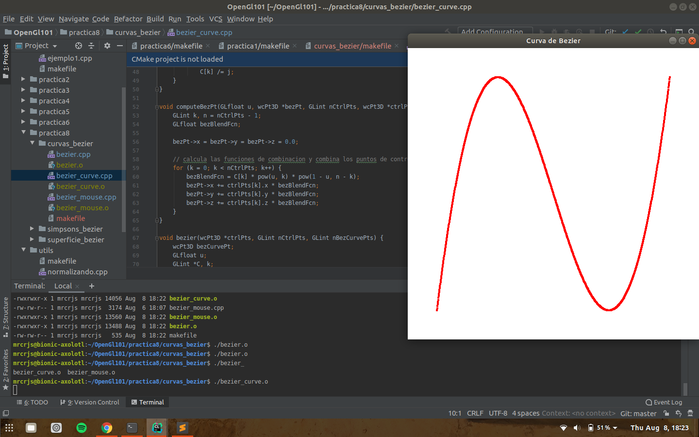

OpenGL 101
============

Graphics in OpenGL

* [OpenGL 101](#opengl-101)
     * [Installation](#installation)
        * [pre-requisites](#pre-requisites)
     * [Contents](#contents)
        * [Practica 1](#practica-1)
           * [ejemplo1.cpp](#ejemplo1cpp)
        * [Practica 2](#practica-2)
           * [actividades.cpp actividades-alt.cpp](#actividadescpp-actividades-altcpp)
        * [Practica 3](#practica-3)
           * [primitiveRobot.cpp](#primitiverobotcpp)
           * [primitiveRobotFunctions.cpp](#primitiverobotfunctionscpp)
        * [Practica 4](#practica-4)
           * [menus.cpp menu.cpp menu_niveles.cpp](#menuscpp-menucpp-menu_nivelescpp)
           * [curvas.cpp](#curvascpp)
           * [key_motion.cpp](#key_motioncpp)
        * [Practica 5](#practica-5)
           * [iluminacion3D.cpp iluminacion3Dpt2.cpp](#iluminacion3dcpp-iluminacion3dpt2cpp)
           * [proyeccion3D.cpp](#proyeccion3dcpp)


### Installation

#### pre-requisites

- OSX or Linux
- OpenGL/Glut
    - [AskUbuntu compiling GLUT](https://askubuntu.com/a/937531/907214)
    - [GLUT how-to](https://web.eecs.umich.edu/~sugih/courses/eecs487/glut-howto/)
- g++
 
```bash
$ git clone git@github.com:MrcRjs/OpenGl101.git
$ cd OpenGl101
```
 

Each practice has it's own makefile, by default it will compile all artifacts

```bash
$ cd practica1
$ make
$ ./basic.o
```

### Contents

#### Practica 1

##### ejemplo1.cpp

Examples on how to use `GL_POINTS, GL_LINES, GL_POLYGON, GL_TRIANGLE, GL_TRIANGLE_STRIP,
GL_TRIANGLE_FAN, GL_QUADS, GL_QUAD_STRIP, GL_LINE_STRIP GL_LINE_LOOP`.


#### Practica 2

##### actividades.cpp actividades-alt.cpp

Translation, rotation and scaling examples using own functions
and OpenGL built-in `glTranslate()` `glRotate()` and `glScale()` 


#### Practica 3

##### primitiveRobot.cpp

Graphing a drawing using only triangles, quadrilaterals and coordinates.


##### primitiveRobotFunctions.cpp

The character is separated into different parts to be drawn with separate functions.


#### Practica 4

##### menus.cpp menu.cpp menu_niveles.cpp

Creation and management of options menus to modify the graphic content using `glutCreateMenu()` `glutAttachMenu()` `glutAddSubMenu()` and `glutAddMenuEntry()`.


##### curvas.cpp

Graphing of different curves, with a menu of options to modify the color, shape and background color.


##### key_motion.cpp

Use keyboard events to modify graphics with `glutKeyboardFunc()`.


#### Practica 5

##### iluminacion3D.cpp iluminacion3Dpt2.cpp 


##### proyeccion3D.cpp





